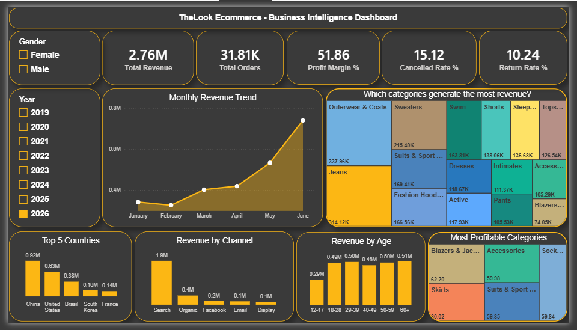

# 🛍️ TheLook Ecommerce — SQL Analysis

An end-to-end SQL analysis of a global fashion ecommerce store using Google BigQuery.
This project covers data exploration, data quality checks, and business insight queries
across sales, products, customers, and operations.

---

## 📂 Project Structure

```
├── 01_EXPLORATION.sql   — first look, row counts, distinct values, date range, null checks, duplicate checks
├── 02_ANALYSIS.sql      — 8 business insight queries with findings and recommendations
└── Dashboard.png           — Dashboard screenshot
```

---

## 📊 Dataset

**Source:** Google BigQuery Public Data
**Dataset:** `bigquery-public-data.thelook_ecommerce`

TheLook is a fictitious fashion ecommerce store created by the Google Looker team.
The dataset is free to query on BigQuery and updates continuously with new synthetic data.

| Table | Description | Rows |
|---|---|---|
| `orders` | Order status, timestamps, item count | 125k+ |
| `order_items` | Sale price, product, status per item | 181k+ |
| `products` | Category, cost, retail price, brand | 29k+ |
| `users` | Age, gender, country, traffic source | 100k |

> ⚠️ This is a live dataset — query results may differ slightly from the report as Google continuously adds new data.

---

## 🔍 How to Run

1. Go to [Google BigQuery Console](https://console.cloud.google.com/bigquery)
2. Sign in with a Google account (free tier includes 1TB/month of free queries)
3. Copy any query from `01_EXPLORATION.sql` or `02_ANALYSIS.sql`
4. Paste into the BigQuery editor and click **Run**

No setup or data download required.

---

## 💡 Business Questions Answered

| # | Question |
|---|---|
| 1 | Is revenue growing month over month? |
| 2 | Which products generate the most revenue? |
| 3 | Which product categories generate the most revenue? |
| 4 | Which categories have the highest profit margin? |
| 5 | What percentage of orders are cancelled or returned? |
| 6 | Which countries generate the most revenue? |
| 7 | Which marketing channel drives the most revenue? |
| 8 | Which customer age group spends the most? |

---

## 🛠️ SQL Skills Used

- `JOIN` — combining orders, products, and users tables
- `CTE` — calculating profit margin in a clean two-step query
- `Window Functions` — calculating percentage of total with `OVER()`
- `Aggregate Functions` — `SUM`, `COUNT`, `MIN`, `MAX`, `ROUND`
- `CASE WHEN` — grouping customers into age buckets
- `FORMAT_TIMESTAMP` — extracting year-month for trend analysis
- `GROUP BY` / `HAVING` — aggregations and duplicate detection
- `DISTINCT` — exploring categorical values

---

## Power BI Dashboard
Built an interactive dashboard connecting directly to BigQuery.
https://drive.google.com/drive/folders/1uaCvZnnfB8ZIu-9xPcC3c7-zOqqk12zW?usp=sharing



**Tools:** Power BI Desktop, DAX, BigQuery
**Features:** 5 KPI cards, slicers, cross-filtering
